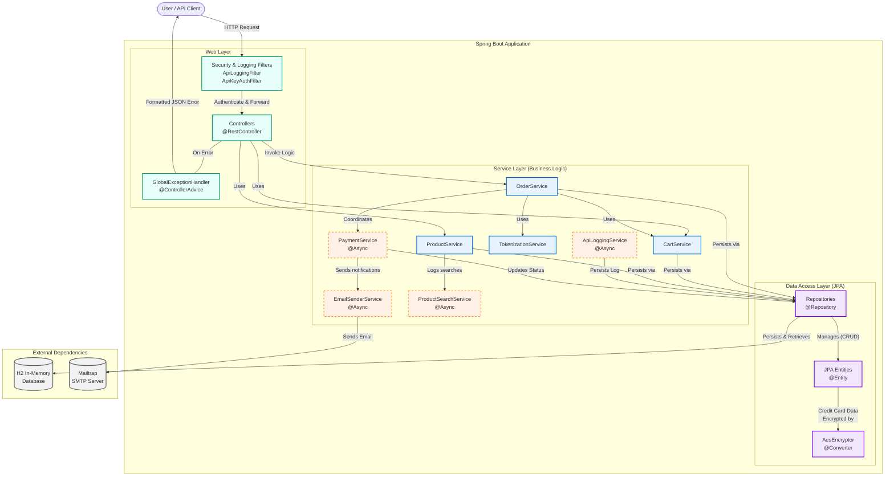

# Reto Técnico: API de E-commerce y Tokenización
Este repositorio contiene la solución al reto técnico para la posición de Desarrollador Java. El proyecto consiste en el diseño, desarrollo y despliegue de una API RESTful que simula un proceso de tokenización de tarjetas, gestión de clientes y un flujo de compras en línea, construido con Java y Spring Boot.
# Requerimientos Funcionales
## Tokenización de Tarjetas de Crédito:
- [x] Crear componente que recibe datos de tarjeta y devuelve un token único.
- [x] API de tokenización autenticada por API Key o Secret Key.
- [x] Configurar probabilidad de rechazo para la creación de tokens.
## Ping API:
- [x] Implementar endpoint /ping que retorne pong con código HTTP 200.
## Gestión de Clientes:
- [x] Permitir el registro de clientes con datos básicos.
- [x] Validar que los datos del cliente sean correctos y únicos (email/teléfono).
## Búsqueda de Productos:
- [x] Implementar funcionalidad para buscar productos.
- [x] Almacenar las búsquedas de forma asíncrona.
- [x] Restringir visualización de productos según stock configurable.
## Carrito de Compras:
- [x] Implementar la funcionalidad para agregar productos al carrito.
## Gestión de Pedidos y Pagos:
- [x] Registrar pedidos con detalles del cliente, tarjeta y dirección.
- [x] Implementar lógica de aprobación/rechazo de pagos con probabilidad configurable.
- [x] Reintentar pago N veces si es rechazado.
## Notificaciones por Correo:
- [x] Enviar correos al cliente en caso de éxito o fallo del pago.
## Logs Centralizados:
- [x] Registrar todos los eventos con un UUID único por transacción en la base de datos.
# Requerimientos No Funcionales y Criterios de Entrega
## Seguridad:
- [x] Implementar autenticación mediante API Key / Secret Key.
- [x] Encriptar datos sensibles (tarjetas de crédito) antes de almacenarlos.

## Escalabilidad y Desempeño:
- [x] Diseñar la arquitectura para soportar concurrencia.
- [x] Centralizar parámetros clave en un archivo de configuración externo.
## Pruebas:
- [ ] Proveer pruebas unitarias con al menos 80% de cobertura.
- [x] Proveer una colección de Postman/Insomnia/Bruno para pruebas.
## Mantenibilidad:
- [x] Diseñar un código modular y documentado.
## DevSecOps:
- [x] Implementar flujos de trabajo para Integración Continua (CI).
- [ ] Implementar flujos de trabajo para Pruebas Continuas.
- [x] Implementar flujos de trabajo para Despliegue Continuo (CD).
## Despliegue:
- [x] El sistema debe ser desplegable usando Docker y Docker Compose.
- [x] La API debe estar desplegada y accesible en línea en un proveedor de hosting.
## Documentación y Entrega:
- [x] Subir el código a un repositorio Git.
- [x] Crear archivo README.md con toda la información requerida.
- [x] Proveer un diagrama de arquitectura.
- [x] Documentar el uso de IA (prompts, links a chats).
- [x] Entregar la solución vía correo electrónico.
## Exposición Oral:
- [x] Preparar una DEMO del sistema.
- [x] Prepararse para la sesión de preguntas y respuestas técnicas.

# Diagramas
## Diagrama de Arquitectura


# Instrucciones de Configuración
Este proyecto requiere esta en la [versión 24 de java](https://www.oracle.com/java/technologies/javase/jdk24-archive-downloads.html).**
## Local
1. Asegúrese de tener Java 24 y Maven instalados.
2. Cree un archivo .env en la raíz del proyecto. Puede usar .env.sample como plantilla.
3. Llene las variables de entorno en el archivo .env (.env.sample de ejemplo).
4. Ejecuta la aplicación según las instrucciones de su sistema operativo o con su IDE.
La API estará disponible en `http://localhost:8080`
## Docker Local
1. Asegúrese de tener Docker instalados.
2. Cree y configure su archivo .env en la raíz del proyecto.
3. Levante toda la pila de servicios (aplicación y base de datos) con el siguiente comando:
```
docker-compose up --build
```
4. La API estará disponible en `http://localhost:8080`
## Pruebas
Unix:
```
mvn test
```
Windows
```
./mvnw.cmd test
```
En `target/sites/…` se generan los reportes de cobertura relevantes.
## Postman
El “workspace” de postman público está [aqui](https://www.postman.com/security-geoscientist-54988258-69125/farmatodo-reto).

Se requiere definir las siguiente variables:
- url (dirección base e.g.: http://localhost:8080)
- api-key (puede ser cualquiera cosa)
- my-email-address (email destination a notifications de prueba. No se mandan notificaciones verdaderas)
- my-name (nombre de cliente principal)

Hay varias colecciones. El flujo principal de la API se logra corriendo secuencialmente las que comienzan con un número. Adicionalmente está `general` por si se desea hit a endpoints específicos.
# Deployment
La API está disponible públicamente aquí. Se utilice [Google Cloud](https://cloud.google.com/) run para ser hosteada.
```
https://farmatodo-reto-tecnico-210297282501.us-south1.run.app
```
## CI/CD
Este proyecto se despliega automáticamente a través de un `push` trigger a `master`.  En `/dockerfile` se indican los pasos para armar el servicio y en `cloudbuild.yaml` la configuración cloud para correr las pruebas unitarias, el build process y las pruebas de healthcheck vía el `/ping` endpoint.
# AI
Utilice Gemini 2.5 PRO para consultar documentación de spring boot y java en general,  generación de contenido para este mismo README y ayuda con el despliegue con Google cloud run. Adicionalmente utilice las capacidades de agentes de cursor con claude-4-sonnet para escribir código repetitivo (Entities, repositorios, etc) y autocompletación general. A continuación las conversaciones:

[Gemini #1](https://g.co/gemini/share/50eaaa47c424)
[Gemini #2](https://g.co/gemini/share/ca72c0430960)
[Gemini #3](https://g.co/gemini/share/587ff95fabd4)

No logre recuperar las conversaciones agenticas.
# Test Coverage
No llegamos al 80% de cobertura total, pero al menos en los controladores sí se cumplió. Ojo: en muchas pruebas usamos un cliente API que pasa por los Filters y otros módulos de seguridad (sí se prueban, pero no cuentan para la cobertura).

![[test-coverage.png]]